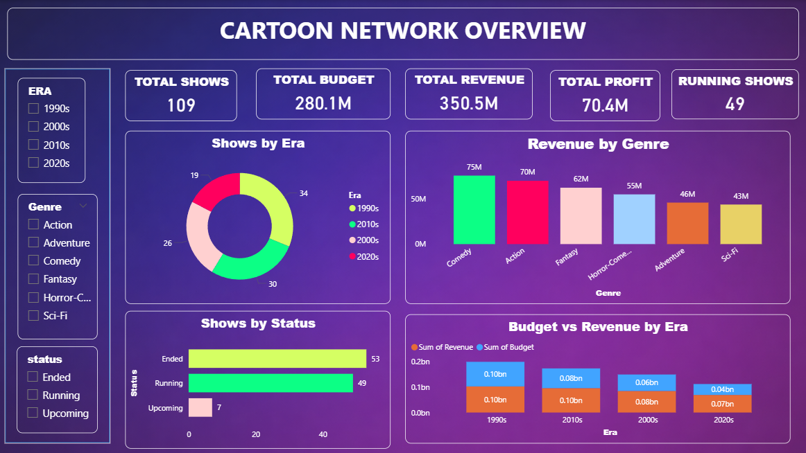

# 📊 Cartoon Network Analytics Dashboard (Power BI)

---

## 📌 Project Overview
This project analyzes Cartoon Network shows across different eras and genres to understand budget, revenue, profit, and performance trends.  
The dashboard helps identify most profitable shows, loss-making shows, and overall business performance using interactive visuals.

---

## 🎯 Objectives
- Analyze total shows, budget, revenue, and profit  
- Compare performance by era and genre  
- Identify top profitable shows  
- Detect shows with financial loss  
- Provide interactive filtering for better insights  

---

## 🛠 Tools & Technologies
- Power BI  
- DAX (Measures & Calculations)  
- Data Modeling  
- Interactive Visuals & Slicers  

---

## 📈 Dashboard Pages

### 🔹 Page 1: Cartoon Network Overview

#### Key KPIs
- Total Shows  
- Total Budget  
- Total Revenue  
- Total Profit  
- Running Shows  

#### Visuals
- Shows by Era  
- Revenue by Genre  
- Shows by Status (Running, Ended, Upcoming)  
- Budget vs Revenue by Era  

📌 **Purpose:** Provides a high-level business overview of Cartoon Network’s performance.

---

### 🔹 Page 2: Show Performance & Details

#### Visuals
- Top 10 Most Profitable Shows  
- Shows with Financial Loss  
- Budget vs Revenue by Show (Scatter Plot)  
- Detailed Table (Budget & Profit by Show)  

📌 **Purpose:** Helps analyze individual show performance and profitability.

---

## 📊 Key Insights
- 1990s shows generated the highest revenue overall  
- Comedy & Action genres performed best financially  
- Some popular shows resulted in financial losses  
- High budget does not always guarantee high profit  

---

## 🧠 Skills Demonstrated
- KPI creation using DAX  
- Data storytelling through visuals  
- Interactive dashboard design  
- Business-focused analysis  

---

## 🚀 How to Use
- Download the `cartoon network.pbix` file  
- Open it in Power BI Desktop  
- Use slicers to filter by era, genre, or show  
- Analyze KPIs and charts for insights  

---

## 📌 Conclusion
This dashboard provides a clear, interactive, and business-focused analysis of Cartoon Network shows.  
It helps stakeholders make data-driven decisions on content investment and performance tracking.
